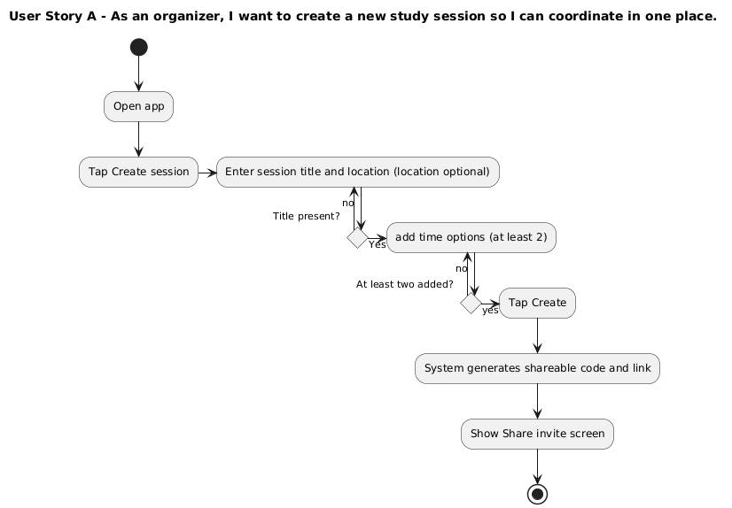

# Specification Phase Exercise

A little exercise to get started with the specification phase of the software development lifecycle. See the [instructions](instructions.md) for more detail.

## Team members

- [Saud Alsheddy](https://github.com/Saud-Al5)
- [Apoorv Belgundi](https://github.com/apoorvib)
- [Morin Zhou](https://github.com/Morinzzz)
- [May Zhou](https://github.com/zz4206)

## Stakeholders

Stakeholder

- Name: Sultan
- Role/ who they are: senior CS student at NYIT. Currently in a lot of study groups and group projects, working on his senior project this semester with 6 other classmates.
- Date interviewed: 9/16

Goals / needs:

- easily propose a group meet up session fast with 2-5 time options
- share a simple code or link that anyone can join (no account)
- See everyone's selections on one screen
- get a clear "winning time" to lock and share
- Mobile flow that is quick for first time users

Problems / frustrations:

- chat messages like discord get buried and confusing to keep up with
- Late replies and unclear emoji reactions
- Hard to compare availability without manual tallying
- Picking a time that later misses someone's availability
- Time-zone difference adds confusion

## Product Vision Statement

GroupMeets is a simple mobile app where an organizer proposes 2–5 time slots, and share a link or code then friends vote on what works, and the organizer confirms the best study-session time quickly.

## User Requirements

As an organizer, I want to add 2–5 time options so I can offer choices.

As an organizer, I want to remove a time option before creating so I can fix mistakes.

As an organizer, I want the Create button disabled until there are at least two time options so I don’t create an empty session.

As an organizer, I want an inline message if anything is missing so I know what to fix.

As a participant, I want to open a link so I can join without any setup.

As a participant, I want to enter a code to join so I can vote even if I don’t have the link.

As any user, I want a clear error if a code is invalid so I know to check with the organizer.

As any user, I want buttons large enough to tap on mobile so I can use it comfortably.

As an organizer, I want to see a shareable code after creation so I can invite people quickly.

As an organizer, I want to copy a link to the session so I can paste it in chat.

As an organizer, I want to see a tally of votes per time so I can compare options.

As an organizer, I want the top-voted option visually highlighted so I can spot the winner fast.

As an organizer, I want to confirm a final time so everyone knows what we chose.

As a participant, I want to see the session title and location so I know what I’m voting on.

As a participant, I want to select one or more time options so I can show when I’m free.

As a participant, I want to deselect an option before submitting so I can change my mind.

As any user, I want labels and helper text on forms so I know what to type or do.

As any user, I want a simple back action on each screen so I can recover from mistakes.

As an organizer, I want to create a new study session so I can coordinate in one place.

As an organizer, I want to enter a session title so I can label what we’re meeting about.

As an organizer, I want to enter a location (simple text) so I can tell people where we’ll meet.

As a participant, I want the Submit button disabled until I pick at least one time so I don’t send an empty vote.

As a participant, I want to return to Home easily so I’m not stuck after voting.

As any user, I want the main flow completable in a few taps so it’s quick during busy days.

## Activity Diagrams

## Clickable Prototype

See instructions. Delete this line and place a publicly-accessible link to your clickable prototype here.
